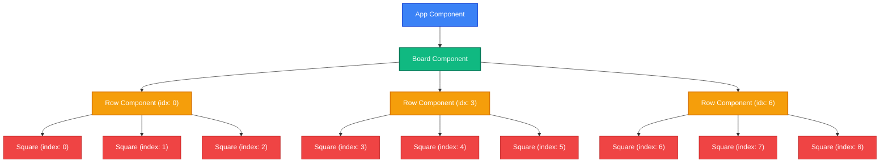

# Tic-Tac-Toe Game (React + Vite)

A modern, simple, component-driven React Tic-Tac-Toe web application built on top of the Vite tooling environment. This codebase demonstrates core React concepts such as state hoisting, component composition, props distribution, event propagation, and render cycles.

---

## Table of Contents

- [1. Overview](#1-overview)
- [2. Component Architecture & Hierarchy](#2-component-architecture--hierarchy)
  - [Component Tree Diagram](#component-tree-diagram)
- [3. Data Flow & Props Distribution](#3-data-flow--props-distribution)
  - [Props Reference Table](#props-reference-table)
  - [Data Flow Diagram](#data-flow-diagram)
- [4. State Management](#4-state-management)
  - [State Definitions](#state-definitions)
  - [State Transition Diagram](#state-transition-diagram)
- [5. What is Rendered (UI Breakdown)](#5-what-is-rendered-ui-breakdown)
  - [Render Tree Representation](#render-tree-representation)
- [6. Core Logic Analysis](#6-core-logic-analysis)
  - [Winning Combinations](#winning-combinations)
  - [The Click Handler (`onSquareClick`)](#the-click-handler-onsquareclick)
  - [Draw Detection & Implementation Analysis](#draw-detection--implementation-analysis)
- [7. How to Run the Application](#7-how-to-run-the-application)

---

## 1. Overview

This project implements a standard **Tic-Tac-Toe (Noughts and Crosses)** game. Two players take turns placing "X" and "O" marks on a 3×3 grid. The game identifies when a player wins (via completing a horizontal, vertical, or diagonal row of three of their marks) or when the game ends in a draw. It also features a game reset button to start a fresh round.

---

## 2. Component Architecture & Hierarchy

The application follows a clean modular hierarchy where state is hoisted up to the closest common ancestor (`Board`) and logic is distributed downwards through properties.

### Component Tree Diagram

This Mermaid diagram maps out the React component instances and how they are nested in the application:



---

## 3. Data Flow & Props Distribution

React follows a **unidirectional data flow**. State values are passed down as **Props**, while user interactions propagate back up to trigger state changes via **Event Callbacks**.

### Props Reference Table

| Component | Prop Name | Type | Description | Origin / Source |
| :--- | :--- | :--- | :--- | :--- |
| **Row** | `valArr` | `Array(3)` | Holds the slice of the board values corresponding to this row (e.g. `val.slice(0, 3)`). | `Board` component state |
| | `handler` | `Function` | Callback trigger for when a square in this row is clicked. Resolves to `onSquareClick`. | `Board` component logic |
| | `idx` | `Number` | The base index of the starting square in this row (0, 3, or 6). | Hardcoded in `Board` render |
| **Square**| `value` | `String \| null` | The mark of this specific cell: `"X"`, `"O"`, or `null`. | `Row` component (`valArr[i]`) |
| | `handlerButton`| `Function` | Callback trigger that executes when the button is clicked. | `Row` component (`handler`) |
| | `index` | `Number` | The absolute 0-indexed position (0 to 8) of the square on the board. | Calculated in `Row` (`idx + offset`) |

### Data Flow Diagram

The following diagram illustrates how props are sent down the tree, and how click events propagate back up to `Board` to trigger state modifications:

```mermaid
flowchart TD
    subgraph Board ["Board Component (State Holder)"]
        valState["val: Array(9) ['X','O',null,...]"]
        isTurnState["isTurn: boolean"]
        clickFn["onSquareClick(index)"]
    end

    subgraph Row ["Row Component (Middleman)"]
        valArr["valArr: Array(3)"]
        handler["handler: Function"]
        idx["idx: number"]
    end

    subgraph Square ["Square Component (Interactive UI)"]
        value["value: 'X' | 'O' | null"]
        handlerButton["handlerButton: Function"]
        index["index: number"]
    end

    %% Downward Props Flow
    valState -->|val.slice(start, end)| valArr
    clickFn -->|Passed as handler prop| handler
    idx -->|Passed as row offset| idx

    valArr -->|valArr[0], valArr[1], valArr[2]| value
    handler -->|Passed as handlerButton prop| handlerButton
    idx -->|Calculated: idx + 0, idx + 1, idx + 2| index

    %% Upward Action Triggering
    clickEvent["User Clicks Square Button"] -.->|onClick Event| handlerButton
    handlerButton -.->|Invokes callback with index| handler
    handler -.->|Bubbles up index parameter| clickFn
    clickFn -->|Updates Board State| valState & isTurnState
```

---

## 4. State Management

All mutable states live in the `Board` component. This lets `Board` act as the single source of truth, enabling easy calculation of the winner, turn status, draw state, and synchronization across all children squares.

### State Definitions

1. **`val`**: 
   - **Type**: `Array(9)`
   - **Initial State**: `[null, null, null, null, null, null, null, null, null]`
   - **Purpose**: Represents the 3x3 game grid. Each element can contain `"X"`, `"O"`, or `null`.

2. **`isTurn`**:
   - **Type**: `Boolean`
   - **Initial State**: `true`
   - **Purpose**: Tracks whose turn it is. `true` indicates **Player X**'s turn, while `false` represents **Player O**'s turn.

### State Transition Diagram

The lifecycle of the state is structured around board clicks and resets:

```mermaid
stateDiagram-v2
    [*] --> InitState : Load Application / Reset
    
    state InitState {
        val : Array(9).fill(null)
        isTurn : true (X's turn)
    }

    InitState --> X_Move : Click Empty Square
    
    state X_Move {
        val[index] : 'X'
        isTurn : false (O's turn)
    }

    state O_Move {
        val[index] : 'O'
        isTurn : true (X's turn)
    }

    X_Move --> WinCondition : Check Winner? Yes
    O_Move --> WinCondition : Check Winner? Yes
    
    X_Move --> DrawCondition : Check Draw? Yes
    O_Move --> DrawCondition : Check Draw? Yes

    X_Move --> O_Move : Check Winner & Draw? No
    O_Move --> X_Move : Check Winner & Draw? No
    
    WinCondition --> GameEnded
    DrawCondition --> GameEnded
    
    GameEnded --> InitState : Click 'Reset Game'
    
    note right of GameEnded
        Board is locked.
        Click handlers return early.
    end
```

---

## 5. What is Rendered (UI Breakdown)

When a render cycle starts, the virtual DOM is recalculated and the browser DOM is updated to reflect the new state. Below is a structural analysis of the DOM elements generated:

### Render Tree Representation

- **Container Fragment (`<> ... </>`)**: Wraps the output elements.
  - **`<h1>` Header**: Displays the current status of the game dynamically.
    - If there is a winner: `Winner is X` or `Winner is O`
    - If there is a draw: `It's a Draw!`
    - Otherwise: `Turn : X` or `Turn : O`
  - **Row Component 1**: Slices `val[0-2]` $\rightarrow$ renders three `Square` buttons.
  - **Row Component 2**: Slices `val[3-5]` $\rightarrow$ renders three `Square` buttons.
  - **Row Component 3**: Slices `val[6-8]` $\rightarrow$ renders three `Square` buttons.
  - **`<br />` Tag**: Line spacing.
  - **`<button>` (Reset)**: Interactive button displaying "Reset Game". Triggers the `Reset` action.

---

## 6. Core Logic Analysis

The game uses clean helpers in `Board` to compute gameplay outcomes on every render cycle.

### Winning Combinations

The game looks for matching values in 8 predetermined trios:
```javascript
const winCombos = [
  [0, 1, 2], // Row 1
  [3, 4, 5], // Row 2
  [6, 7, 8], // Row 3
  [0, 3, 6], // Column 1
  [1, 4, 7], // Column 2
  [2, 5, 8], // Column 3
  [0, 4, 8], // Diagonal 1
  [2, 4, 6], // Diagonal 2
];
```

### The Click Handler (`onSquareClick`)

When a user clicks on square `index`:
1. **Checks Game End**: Returns early if a winner or draw is already declared:
   ```javascript
   if (Winner(val) || Draw(val)) return;
   ```
2. **Checks Square Availability**: Returns early if the square is already filled:
   ```javascript
   if (val[index] !== null) return;
   ```
3. **State Cloning**: Follows React's immutability best practices by copying the array:
   ```javascript
   const copy = [...val];
   ```
4. **Applies Move**: Sets `copy[index]` to `"X"` or `"O"` depending on `isTurn`.
5. **State Update**: Updates states `val` and toggles `isTurn`, triggering a full components re-render.

### Draw Detection & Implementation Analysis

> [!WARNING]
> **Code Logic Alert / Bug Notice**
> 
> The current codebase includes a logical bug in the `Draw` helper function:
> 
> ```javascript
> function Draw(board) {
>   if(!Winner(board)) return false;
>   return !board.includes(null);
> }
> ```
> 
> **Why this is a bug:**
> - If there is **no winner**, `Winner(board)` returns `null`. Thus, `!Winner(board)` evaluates to `true`, causing the function to return `false` immediately.
> - Consequently, the function **never** detects a draw when the board is full and no player has won.
> - Conversely, if there **is a winner**, `!Winner(board)` evaluates to `false`, causing the function to fall through and check `!board.includes(null)`. This means it checks for a draw only when a player wins, which is incorrect.
>
> **Recommended Bug Fix:**
> To fix this issue, rewrite the `Draw` helper to check if there is no winner **and** the board has no empty (`null`) cells:
> ```javascript
> function Draw(board) {
>   // If there is a winner, it cannot be a draw
>   if (Winner(board)) return false;
>   // It's a draw if the board has no empty squares left
>   return !board.includes(null);
> }
> ```

---

## 7. How to Run the Application

The project is built on **Vite**, offering high-speed Hot Module Replacement (HMR).

### Prerequisites
Make sure you have [Node.js](https://nodejs.org/) installed on your computer.

### Step 1: Install Dependencies
Open your terminal in the `Tic Tac Toe` directory and run:
```bash
npm install
```

### Step 2: Start Development Server
Launch the development server:
```bash
npm run dev
```
By default, the application will run at [http://localhost:5173](http://localhost:5173).

### Step 3: Build for Production
To bundle the application for production deployment, run:
```bash
npm run build
```
The compiled output will be placed in the `dist` directory.
